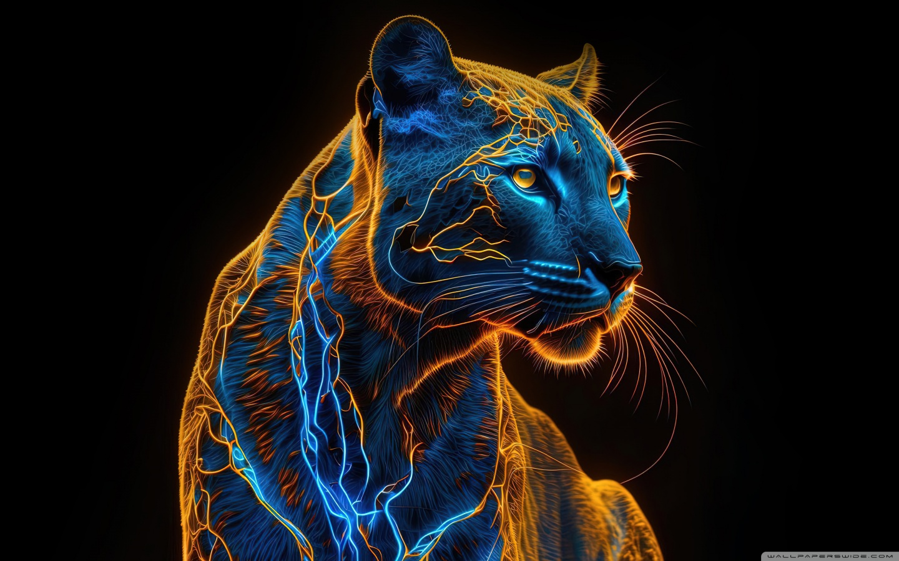

# 👋 Hi, I'm GongRzhe

  

  <h1>GongRzhe</h1>
  
<i>Technology Leader of Digital Twins Team | MCP Developer | AI Enthusiast</i>

  
  
  

## 🌟 About Me

I'm a Technology Leader of a Digital Twins Team with a passion for AI innovation. I specialize in building Model Context Protocol (MCP) servers that enable AI assistants to interact with various applications and services through natural language interfaces. My work focuses on creating standardized interfaces that bridge the gap between AI models and everyday applications.

- 👨‍💻 Pronouns: he/him
- 📫 How to reach me: [gongrzhe@gmail.com](mailto:gongrzhe@gmail.com)
- 🔗 GitHub: [github.com/GongRzhe](https://github.com/GongRzhe)

## 🚀 MCP Ecosystem

I'm building an ecosystem of MCP servers that allow Large Language Models (LLMs) and AI assistants to securely interact with various applications:

## 💻 Technologies & Skills

  
  
  
  
  
  
  
  
  
  
  

## 📊 GitHub Stats

  
  

## 🔭 I'm currently working on

- Leading Digital Twins technology development and implementation
- Expanding the MCP server ecosystem to support more applications
- Integrating AI technologies like LangChain and PydanticAI with enterprise systems
- Building workflow automation solutions with tools like n8n
- Creating standardized interfaces for AI models to interact with popular services
